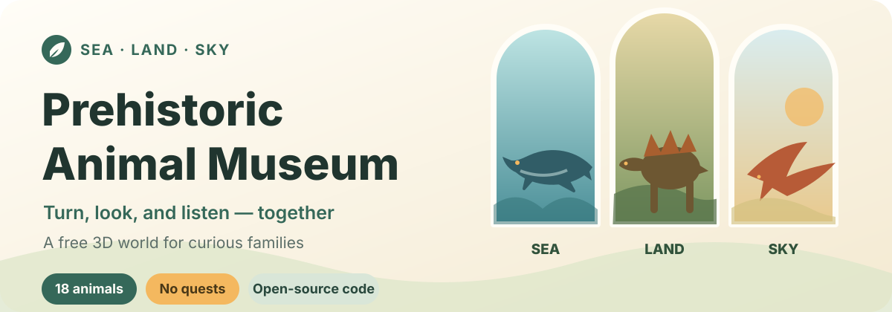

<p align="center">
  
</p>

<p align="center">
  <strong>For curious children and the grown-ups willing to sit beside them.</strong><br>
  WonZoo is a free children's science website: meet prehistoric and modern animals in 3D, in English, Simplified Chinese, Traditional Chinese, or Japanese, with short narration, gentle care play, AR, and a parent guide.
</p>

<p align="center">
  <strong><a href="https://leon-made-this.work/museum/">Open WonZoo →</a></strong>
  · <strong>English</strong>
  · <a href="README.zh-CN.md">简体中文</a>
</p>

<p align="center">Free to visit · No account · No ads in the app · No analytics scripts</p>

| Sea · Mosasaurus | Land · Stegosaurus | Sky · Tupandactylus |
| :---: | :---: | :---: |
|  |  |  |

## From a small prehistoric museum to WonZoo

I wanted to give her a place with no winning or losing and no frightening scene waiting around the corner. A child can choose an animal, turn it around, and listen to a short introduction. A grown-up can add a thought, ask a question, or simply stay beside them.

It is now growing into WonZoo, a science website for children: alongside dinosaurs and other ancient giants, dogs, cats, insects and ocean friends are moving in, and the exhibits now stretch beyond land, sky and sea into plains, forest, ice and the insect world.

It still is not designed to keep children on the screen. Discovering one interesting detail is enough.

## Explore together

- **Look from every side:** drag with a finger or mouse to turn a 3D model, then pinch or scroll to zoom.
- **Care for a friend:** offer a bowl of leaves or meat, help with a bath, play ball, or invite the animal for a little walk.
- **Invite a friend into the room:** open AR and the camera places the animal on your table or floor; the video is processed on your device and never recorded, saved, or uploaded.
- **Listen when you choose:** short English and Mandarin narration never auto-plays.
- **Follow the questions:** the parent guide covers when an animal lived, fossil discovery regions, size, diet, classification, and source references.
- **Use it comfortably:** the responsive layout adapts to phone, tablet, and desktop screen sizes, supports keyboard navigation, and respects reduced-motion settings.

The site follows the device language on a first visit. You can switch between English, Simplified Chinese, Traditional Chinese, and Japanese at any time; the choice is remembered, and each language has a shareable link.

WonZoo is designed mainly for children aged 2–6 with a grown-up nearby, but curiosity matters more than the age label. If an image or sound feels uncomfortable, choose another animal or close the page.

## The collection: 18 prehistoric animals today, and still growing

You can meet 18 prehistoric animals today:

<details>
<summary><strong>See the full collection</strong></summary>

- **Land:** Stegosaurus, Pachycephalosaurus, Tyrannosaurus rex, Triceratops, Apatosaurus, Gigantoraptor, Woolly mammoth, Maiasaura, Sauropelta, and Dilophosaurus.
- **Sky:** Pteranodon, Rhamphorhynchus, Tupandactylus, and Meganeura.
- **Sea:** Ichthyosaurs, Plesiosaurs, Megalodon, and Mosasaurus.

</details>

The content library is preparing more than 150 modern animals — from dogs and cats such as the Shiba Inu and Welsh Corgi, to insects such as the Hercules beetle and firefly, to ocean friends like the jellyfish and octopus. Zone navigation covers dinosaur, plains, forest, ice, ocean, insect, and sky exhibits, and these new friends will gradually move onto their own 3D stages.

The ichthyosaur and plesiosaur exhibits represent broader groups of related animals rather than one exact species. Fossils do not preserve every answer, so colours, soft tissue, and some movement are evidence-informed artistic reconstructions rather than exact portraits.

## A calm, private visit

- Neither the website nor the packaged app has sign-in or user profiles, and neither asks for names, contact details, or children's information.
- The packaged app contains no advertising or analytics SDKs; the website may show ads served by Google AdSense, as explained in the in-app privacy policy.
- AR uses the camera only when you open it; the feed is processed on your device and is never recorded, saved, or uploaded.
- Browsing makes no runtime calls to AI or analytics services; models, images, and narration are prepared static assets.
- No autoplay and no pressure to “finish” the whole zoo.

## Run and contribute

### Local development

Node.js 20.19 or newer is required.

```sh
npm ci
npm run dev
```

<details>
<summary><strong>Run the project checks</strong></summary>

```sh
npm run lint
npm run typecheck
npm test -- --run
npm run build
npm run test:e2e
```

</details>

<details>
<summary><strong>Generate exhibit assets</strong></summary>

Draft assets are prepared offline by small generator scripts:

```sh
npm run generate:backgrounds:dry-run -- <animal-id>   # preview the prompts first
npm run generate:backgrounds -- <animal-id>           # landscape + portrait scene pair
npm run generate:backgrounds:batch                    # curated slug list (scripts/background-batch.json)
npm run generate:backgrounds:all                      # every animal still missing a pair
npm run generate:model-previews -- <animal-id>        # WebGL loading images
```

> On PowerShell 7.2+ the `--` separator is swallowed before native commands, so
> `npm run <script> -- <flags>` silently loses its flags there. Prefer the
> arg-free `:batch` / `:all` variants, or call the script directly with
> `npx tsx scripts/generate-animal-backgrounds.ts <flags>`.

The background generator tells the image model which exhibit animal each
backdrop is staged for — name, classification, era, and native range come from
the package content — and writes a provenance record next to the images. It
reads its session cookie from `IMAGE_API_COOKIE` in `.env`. See the
[animal authoring guide](ANIMAL_AUTHORING_GUIDE.md) for the full workflow and
the remaining generator scripts in `package.json`.

</details>

<details>
<summary><strong>Package the mobile apps</strong></summary>

The same codebase can be packaged as mobile apps, which never load the ad script:

```sh
npm run cap:sync          # build the static bundle and sync the Android / iOS Capacitor projects
npm run harmony:build     # build the HarmonyOS app resources
```

</details>

### Contributing

To propose a new animal, start with the [animal authoring guide](ANIMAL_AUTHORING_GUIDE.md). For code, content, or asset changes, read [CONTRIBUTING.md](CONTRIBUTING.md) before opening a pull request.

## Licences and sources

This repository has several clear legal layers:

- Software code uses [GNU AGPL-3.0-only](LICENSE).
- Original science writing, narration, exhibit backgrounds, and similar content use [CC BY-NC-SA 4.0](LICENSES/CC-BY-NC-SA-4.0.txt).
- Third-party libraries, fonts, 3D models, and mixed assets retain their own recorded terms.
- “Leon做了个 / Leon Made This”, the project names, logos, and source-identifying brand elements are reserved to prevent confusion about the official source; renamed and rebranded forks remain welcome within the applicable licences.

See the [licensing guide](LICENSING.md), [brand policy](BRAND_POLICY.md), [contribution terms](CONTRIBUTING.md), and [third-party notices](THIRD_PARTY_NOTICES.md) for licensing boundaries and recorded attributions, sources, and modifications.
