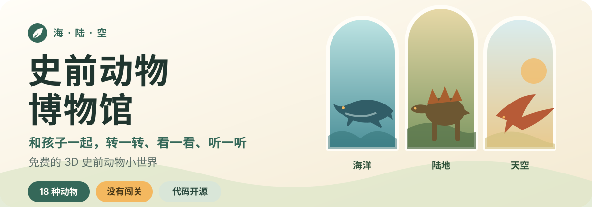
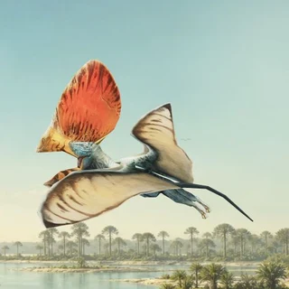

<p align="center">
  
</p>

<p align="center">
  <strong>给好奇的孩子，也给愿意坐在一旁一起看的大人。</strong><br>
  WonZoo 是一个免费的儿童科普网站：用简体中文或英文，以 3D 模型、短旁白、亲子互动和 AR，带孩子认识史前与现代的动物朋友。
</p>

<p align="center">
  <strong><a href="https://leon-made-this.work/museum/">进入 WonZoo →</a></strong>
  · <a href="README.md">English</a>
  · <strong>简体中文</strong>
</p>

<p align="center">免费访问 · 无需注册 · 应用内无广告 · 无分析统计脚本</p>

| 海 · 沧龙 | 陆 · 剑龙 | 空 · 古神翼龙 |
| :---: | :---: | :---: |
|  |  |  |

## 从一座史前小展馆，长成 WonZoo

我想给她一个没有输赢，也没有惊吓画面等在下一秒的地方。孩子可以选一只动物，换个角度观察，再听一段简短介绍；大人可以补充一句、问一个问题，也可以什么都不说，只陪着看。

现在它正在长成 WonZoo——一个面向孩子的动物科普网站：除了恐龙和远古巨兽，狗、猫、昆虫和海洋朋友也在陆续搬进来，展区也从海、陆、空延伸到草原、森林、冰川和昆虫世界。

它依然不追求让孩子一直留在屏幕前。一次发现一个有趣的细节，就已经足够。

## 一起逛逛

- **换个角度观察**：用手指或鼠标拖动 3D 模型，双指或滚轮可以放大、缩小。
- **照顾动物朋友**：给它端上一碗树叶或肉肉，帮它洗澡、陪它玩球，再带它走一走。
- **把朋友请到身边**：打开 AR，用摄像头把它放到你面前的桌子或地板上；画面只在设备本地实时处理，不会录制、保存或上传。
- **想听时再听**：普通话和英文短旁白都不会自动播放。
- **顺着问题聊下去**：家长资料包含生活时期、化石发现地区、体型、食性、分类和参考来源。
- **舒服地使用**：响应式排版适配手机、平板和桌面尺寸，也能用键盘操作，并尊重系统的“减少动态效果”设置。

第一次打开时，网站会跟随设备语言。你可以随时切换简体中文和英文；选择会被记住，也可以直接分享对应语言的链接。

WonZoo 主要为 2～6 岁孩子设计，建议第一次探索时有大人陪在身边。年龄不是门槛；如果某个画面或声音让孩子不舒服，换一只动物或直接关掉就好。

## 馆藏：18 种史前动物，还在继续长大

今天可以先认识 18 种史前动物：

<details>
<summary><strong>查看完整馆藏</strong></summary>

- **陆地**：剑龙、肿头龙、霸王龙、三角龙、迷惑龙、巨盗龙、长毛猛犸象、慈母龙、胄甲龙、双冠龙。
- **天空**：无齿翼龙、喙嘴翼龙、古神翼龙、巨脉蜻蜓。
- **海洋**：鱼龙类、蛇颈龙类、巨齿鲨、沧龙。

</details>

内容库还在准备 150 多种现代动物——从柴犬、柯基这样的猫猫狗狗，到独角仙、萤火虫这样的昆虫，再到水母、章鱼这样的海洋朋友。展区导航覆盖恐龙、草原、森林、冰川、海洋、昆虫和天空，这些新朋友也会陆续搬进自己的 3D 展台。

“鱼龙类”和“蛇颈龙类”分别代表较大的动物类群，并不是某一个确定物种。化石没有留下全部答案，因此模型的颜色、软组织和部分动作属于基于现有证据的艺术复原，并不是能够完全确定的原貌。

## 安心地打开，也安心地关掉

- 网站和安装版应用都没有登录和用户档案，也不会索取姓名、联系方式或儿童信息。
- 安装版应用不包含广告和分析 SDK；网页版可能展示由 Google AdSense 提供的广告，相关说明见应用内隐私政策。
- AR 只在你主动打开时才使用摄像头，画面仅在设备本地实时处理，不会录制、保存或上传。
- 逛展时不会调用 AI 或分析服务；模型、图片和旁白都是预先准备好的静态内容。
- 没有自动播放，也不会催着孩子“逛完整个 WonZoo”。

## 在本地运行与参与

### 本地运行

需要 Node.js 20.19 或更新版本。

```sh
npm ci
npm run dev
```

<details>
<summary><strong>运行项目检查</strong></summary>

```sh
npm run lint
npm run typecheck
npm test -- --run
npm run build
npm run test:e2e
```

</details>

<details>
<summary><strong>生成展厅素材</strong></summary>

草稿素材由小型生成脚本离线准备：

```sh
npm run generate:backgrounds --dry-run <animal-id>   # 先预览生图提示词
npm run generate:backgrounds -- <animal-id>             # 生成横竖两张展厅背景
npm run generate:model-previews -- <animal-id>          # 生成 WebGL 加载占位图
```

背景生成脚本会把展位动物的身份——名称、分类、年代、分布区，取自该动物的文案包——写进提示词，让生图模型产出与物种栖息地匹配、且不含任何动物本体的舞台背景，并在图片旁写入生成留痕记录。生图会话 Cookie 从 `.env` 的 `IMAGE_API_COOKIE` 读取。完整流程和其余生成脚本见[动物包编写指南](ANIMAL_AUTHORING_GUIDE.md)与 `package.json`。

</details>

<details>
<summary><strong>打包手机应用</strong></summary>

同一个代码库可以打包为手机应用，应用内不加载广告脚本：

```sh
npm run cap:sync          # 构建静态包并同步到 Android / iOS Capacitor 工程
npm run harmony:build     # 构建鸿蒙 HarmonyOS 应用资源
```

</details>

### 参与贡献

如果想提议一种新的动物，请先阅读[动物包编写指南](ANIMAL_AUTHORING_GUIDE.md)。提交代码、内容或素材前，请阅读[贡献指南](CONTRIBUTING.md)。

## 许可与素材来源

这个仓库包含几层边界清晰的许可：

- 软件代码采用 [GNU AGPL-3.0-only](LICENSE)。
- 原创科普文案、旁白、展厅背景和类似内容采用 [CC BY-NC-SA 4.0](LICENSES/CC-BY-NC-SA-4.0.txt)。
- 第三方库、字体、3D 模型和混合素材继续遵守各自记录的许可。
- “Leon做了个 / Leon Made This”、项目名称、标志及用于识别官方来源的品牌元素仅保留防止冒充官方所需的权利；在适用许可范围内，改名和替换品牌后的 Fork 仍然受到欢迎。

许可边界以及已记录的署名、来源和修改信息见[许可说明](LICENSING.md)、[品牌政策](BRAND_POLICY.md)、[贡献指南](CONTRIBUTING.md)与[第三方素材说明](THIRD_PARTY_NOTICES.md)。
